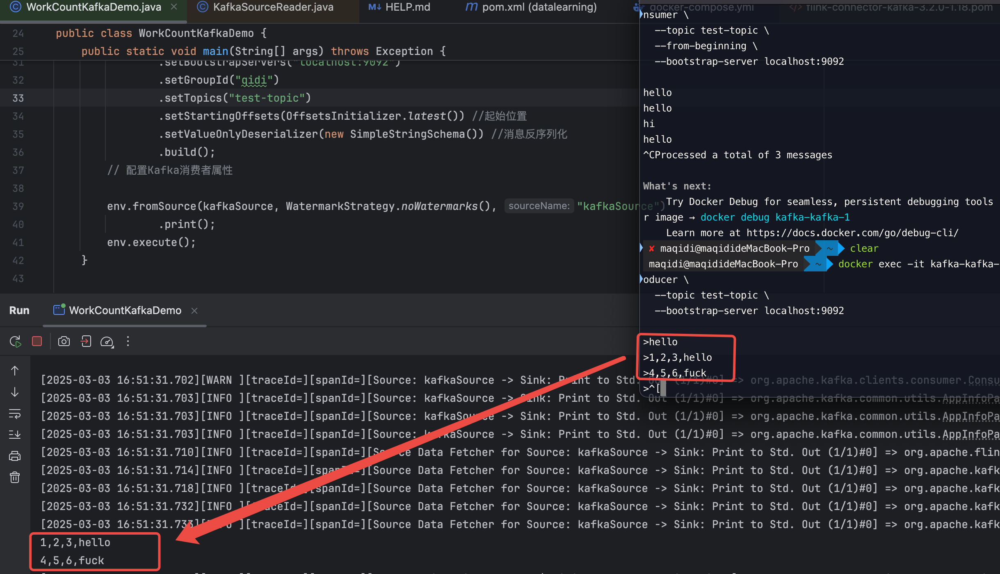

### 1.启动环境

```bash
#进到指定目录
cd deployment/kafka
#启动镜像
docker-compose up -d
```


### 2. 创建测试主题（在单独终端执行）

```bash
docker exec -it kafka-kafka-1 kafka-topics \
  --create \
  --topic test-topic \
  --partitions 1 \
  --replication-factor 1 \
  --bootstrap-server localhost:9092
```

如果已经启动一次，直接链接就好

```bash
docker exec -it kafka-kafka-1 kafka-console-producer \
  --topic test-topic \
  --bootstrap-server localhost:9092
```


### 3. 启动控制台生产者（新终端）

```bash
docker exec -it kafka-kafka-1 kafka-console-producer \
  --topic test-topic \
  --bootstrap-server localhost:9092
```


### 5. 启动控制台消费者（新终端）

```bash
docker exec -it kafka-kafka-1 kafka-console-consumer \
  --topic test-topic \
  --from-beginning \
  --bootstrap-server localhost:9092
```

详见：

### 6. 验证 Flink 连接

在 Flink 程序中使用以下配置：

启动生产者

在代码中[WorkCountKafkaDemo.java](..%2F..%2Fsrc%2Ftest%2Fjava%2Fcom%2Fqidi%2Fdatalearning%2FWorkCountKafkaDemo.java)
发送查看控制台打印


### 常见问题排查：

1. **连接问题**：确保 `KAFKA_ADVERTISED_LISTENERS` 设置为 `PLAINTEXT://localhost:9092`
2. **端口冲突**：检查 9092 和 2181 端口是否被占用
3. **容器状态**：使用 `docker-compose logs` 查看日志

### 停止环境

```bash
docker-compose down
```